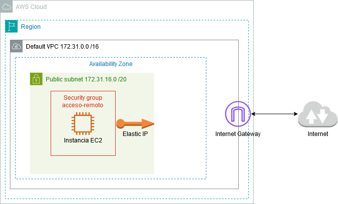
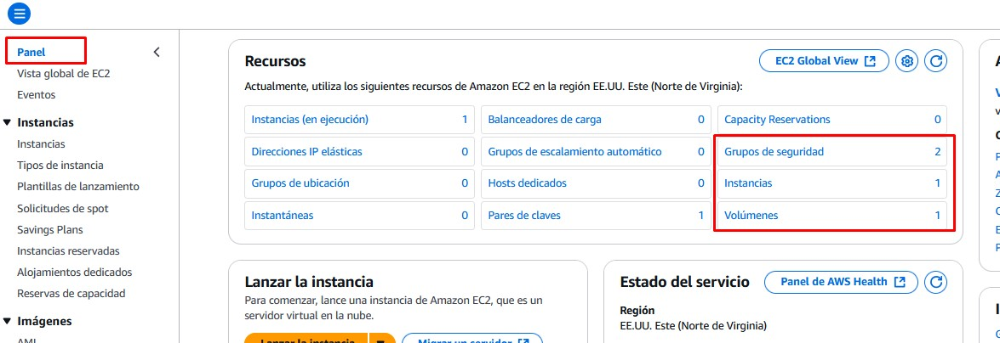
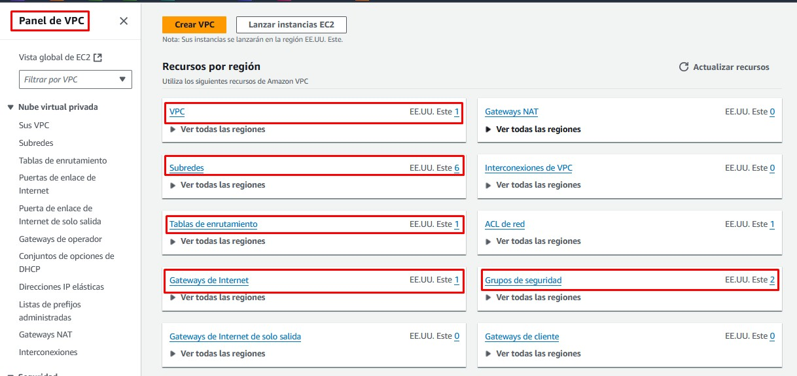

# Creación de una Máquina Virtual

## Objetivo del Proyecto

En esta práctica vamos a crear en la nube una máquina virtual de Windows Server 2025 y nos conectaremos a ella por RDP. Conoceremos los recursos de AWS asociados a la creación de esa máquina virtual:

- La instancia EC2 (la propia máquina virtual).
- El volumen EBS asociado (el disco duro de la máquina virtual).
- La red (VPC) y la subred virtual a la que está conectada la máquina.
- Un Internet Gateway (puerta de enlace) para salir a Internet desde la red virtual.
- Una dirección IP pública para conectarnos desde el exterior.
- Una dirección IP Elástica (la IP pública, pero estática, para que no cambie al reiniciar la máquina).
- Un grupo de seguridad para controlar los accesos.

## Esquema en AWS

## Práctica a Realizar

### Acceso a EC2

1.- Vamos a crear directamente una máquina en la red virtual (VPC) creada por defecto. Para ello accedemos directamente al servicio de máquinas virtuales de AWS llamado EC2 (Amazon Elastic Compute Cloud).

- Buscamos el servicio **EC2** en la consola.
- Accedemos y pulsamos sobre **Lanzar la Instancia**.

!!! note "Nota"
    
    Tenemos una red creada de manera predeterminada con una dirección de red **172.31.0.0/16**, la cual tiene 6 subredes ubicadas en 6 zonas de disponibilidad distintas de la región en la que se lanza el laboratorio (Norte de Virginia: *us-east-1*). Vamos a crear la máquina en esta red por defecto.

 
___

### Lanzamiento de la instancia

2.- Para lanzar la instancia EC2 es necesario asignarle una serie de parámetros obligatorios y configurar otros opcionales.

- El nombre del equipo será *W2025*
- Seleccionamos una imagen (AMI) de *Microsoft Windows Server 2025 Base*.
- En el tamaño de la máquina seleccionamos un tipo de instancia *t3.medium* (2 CPUS y 4 GiB de RAM)
- En el par de claves podemos elegir entre crear un nuevo par de claves o utilizar las ya creadas de nuestro laboratorio (*vockey*). Seleccionamos las ya creadas *vockey*.
- En la configuración de red pulsamos en Editar:
    - Dejamos la VPC (la red virtual) predeterminada.
    - Seleccionamos una subred (por ejemplo la asociada a la zona de disponibilidad 2 cuyo nombre es *us-east-1b* y su dirección de red es *172.13.16.0/20*)
    - Habilitamos la asignación de una IP Pública para conectarnos desde Internet a esta máquina.
    - Creamos un grupo de seguridad (reglas de firewall) nuevo y lo llamamos *acceso-remoto* y le ponemos una descripción (*acceso remoto a W2025*)
    - Como regla de entrada dejamos la que viene por defecto que habilita el *puerto 3389 (RDP)* desde *cualquier lugar* de Internet (0.0.0.0/0)
- Dejamos las opciones de almacenamiento que nos propone por defecto: 30GiB en un disco *SSD de uso general*.
- Lanzamos la instancia.

 
___

### Comprobación de los recursos creados

Tras unos minutos se nos crea la instancia, y con ella los siguientes recursos que podemos comprobar.

3.- Accede al panel principal de EC2.

Comprueba pinchando sobre el enlace correspondiente que se ha creado:

- Una **instancia** (máquina).
- Un **volumen EBS** (disco duro).
- 2 **Grupos de seguridad** (el que venía por defecto y el que hemos creado llamado *acceso-remoto*).

 

4.- Accede en la consola al panel de VPC.

Comprueba que nos aparece una VPC que ya venía creada por defecto. Accede a ella y verás las subredes y recursos asociados:

- 6 **Subredes** en 6 AZs
- 1 **Tabla de enrutamiento** utilizada por todas las subredes.
- 1 Conexión de red a Internet: **Internet Gateway**

 
___

### Acceso por RDP

Vamos a iniciar una sesión de escritorio remoto en la máquina creada. Al crear la máquina no nos ha solicitado nombre de usuario y contraseña. Por seguridad, nos crea una contraseña compleja que solamente podemos ver utilizando el par de claves pública y privada que hemos seleccionado al crear la máquina.

El primer paso para poder ver la contraseña es descargarnos el fichero de la clave o copiar el contenido. 

5.- Accede a la **consola de lanzamiento del laboratorio** y en *Detalles* pulsa sobre una de las opciones de descarga o visualización de la clave privada. Descarga, por ejemplo, el fichero PEM.

6.- En la **consola de AWS** accede al panel de la instancia EC2 que acabamos de lanzar y pulsa sobre *Conectar*. En la pestaña de *Cliente RDP* descarga el archivo RDP y pulsa sobre *Obtener Contraseña*. Para descifrarla te pide la clave privada que acabas de descargar.

Una vez descifrada, ya podemos abrir el fichero RDP descargado e introducir el usuario (*Administrator*) y la contraseña para iniciar sesión.

 
___

### Acceso por SSH

Vamos a iniciar ahora una sesión al servidor *W2025* desde nuestra máquina local, pero esta vez utilizando el protocolo SSH.

7.- En primer lugar, con la sesión de Escritorio Remoto abierta en la máquina Windows Server realiza las siguientes acciones:

- Habilita en el panel del **Administración del servidor** el **Acceso Remoto por SSH**.
- En el firewall de Windows (**Windows defender firewall with advanced security** que se encuentra en las **Herramientas Administrativas**) añade una regla de entrada para permitir conexiones del puerto 22 desde cualquier red.

 

8.- Ahora, en la **consola de AWS**, configura el **grupo de seguridad** que creamos en el momento de lanzar la instancia (*acceso-remoto*) y edita las *Reglas de entrada* para añadir el protocolo SSH (puerto TCP 22) desde cualquier dirección IPv4.

 

9.- Desde el panel de EC2, vemos los detalles de nuestra instancia en ejecución y comprobamos la IP Pública asignada a la instancia.

 

Ya podemos desde un terminal lanzar un ssh a la dirección pública asociada a nuestra instancia EC2:

    ssh administrator@54.242.76.151

!!! note "Nota"

    Nos hemos conectado por contraseña, lo cual es una práctica poco recomendada en AWS. Veremos que en las instancias con Linux lo haremos siempre mediante un par de claves.

___

### Asignación IP Elástica

Esa dirección IP pública a la que nos hemos conectado no es fija, de modo que cada vez que se reinicie la instancia (o apaguemos el laboratorio) la dirección puede cambiar. Podemos asignar una IP fija (con un incremento del costo) a nuestra máquina para evitar que esto suceda. Para ello utilizamos las **IP Elásticas** de AWS.

10.- En el panel de recursos de EC2, accede a **Direcciones IP elásticas**:

- **Asigna** (crea) una nueva dirección elástica.
- Una vez creada, hay que **asociarla a un recurso**. En nuestro caso a la instancia EC2. En Acciones selecciona la opción Dirección IP elástica asociada y elige el id de la instancia *W2025*.
- Esta acción provocará un cambio inmediato de la dirección IP Pública que teníamos por la nueva IP elástica, obligando a rehacer las conexiones.

 
___

### Liberación de recursos

11.- Una vez finalizada la práctica hay que eliminar los recursos creados para que no nos consuman crédito:

- Comenzamos liberando la IP elástica. Para ello **desasociamos la IP elástica** y a continuación seleccionamos la opción **Publicar dirección IP elástica**. (Publicar = hacer pública = disponible).
- Terminamos la instancia. En el panel de EC2, con la instancia seleccionada, pulsamos sobre la Acción **Terminar (eliminar) instancia**. Nos informa que el volumen EBS asociado también se eliminará.
- Por último, eliminamos el grupo de seguridad *acceso-remoto*.

Recuerda finalizar el laboratorio.
