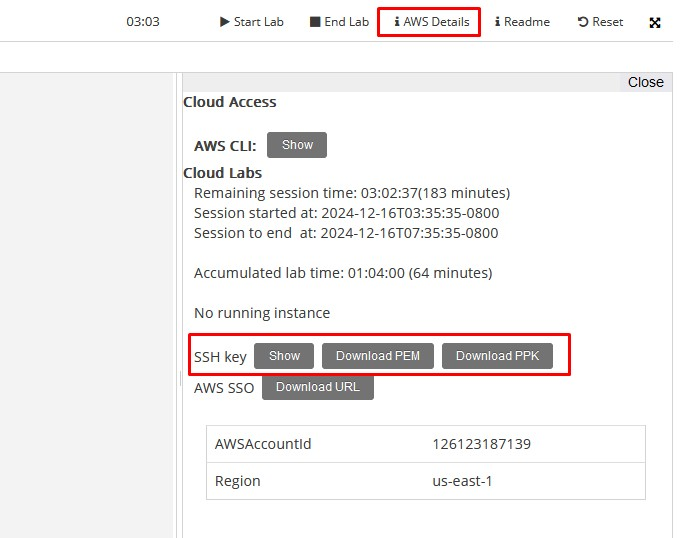

# Redes Virtuales

## Objetivo del Proyecto

En la práctica de creación de la Máquina Virtual hemos visto que al crear una máquina en Azure se nos crean una serie de recursos asociados a la red en la que se encuentra la máquina:
- La tarjeta de red de la máquina virtual.
- La red virtual a la que está conectada esa tarjeta de red.
- Un grupo de seguridad que ejerce de cortafuegos.
- Una dirección IP pública para conectarnos desde el exterior.

En esta práctica vamos a crear de manera manual todos estos recursos para poder configurarlos según nuestras necesidades. Vamos a implementar un esquema en el que tendremos una red virtual con dos subredes (*subred-dmz* y *subred-privada*). En cada una de ellas crearemos una máquina virtual Ubuntu:
- La primera será accesible desde el exterior de la red (desde Internet) y para ello crearemos un grupo de seguridad en el que habilitaremos el puerto 22 (ssh) para que puedan entrar desde cualquier dirección.
- La segunda máquina estará en la subred-privada y configuraremos su grupo de seguridad para que sea accesible únicamente desde la *subred-dmz*, sin acceso desde el exterior.

## Esquema en AWS

## Práctica a Realizar

### Eliminación de la VPC por defecto

Comenzamos por eliminar la VPC creada por defecto junto con todos sus recursos asociados.

1.- Accedemos al panel VPC y eliminamos la VPC. Nos informa que se eliminarán 8 recursos asociados:

- Las 6 subredes públicas
- El Internet Gateway
- El Grupo de Seguridad

___

### Creación de la nueva VPC

2.- Procedemos a crear la VPC:

-	Le decimos que queremos crear **la VPC y más**.
-	Asignamos un nombre a la VPC, por ejemplo *practica02*
-	Como dirección de red (Bloque de CIDR IPv4) dejamos la 10.0.0.0/16
-	Seleccionamos una única zona de disponibilidad (AZ).
-	Le decimos que nos cree una subred pública y otra privada.
-	Personalizamos los bloques de direcciones de modo que las subredes tengan las siguientes direcciones:
  -	Subred pública: 10.0.1.0/24
  - Subred privada: 10.0.2.0/24
-	Como deseamos que la subred privada tenga salida a Internet, creamos un **Gateway NAT** en 1 AZ (ojo, esto nos incrementará el coste considerablemente).
-	No vamos a conectar ningún bucket de S3, por tanto no seleccionamos ningún *Gateway de S3* en el apartado de *Puntos de enlace de la VPC*.

 
___

### Comprobación de los recursos creados

3.- Comprobamos los recursos creados:

- La VPC (*practica02-vpc*).
- Las 2 subredes (*practica02-subnet-public1* y *practica02-subnet-private1*).
- El Internet Gateway (*practica02-igw*).
- Las 2 tablas de enrutamiento (una por cada subred: *practica02-rtb-public* y *practica02-rtb-private*).
- Una tabla de enrutamiento por defecto.
- Un Grupo de Seguridad por defecto.
- El NAT Gateway (*practica02-nat-public1*) ubicado en la subred pública para dar salida a Internet en la subred privada.
- Una IP Elástica asociada al NAT Gateway (*practica02-eip*).

 
___

### Tablas de enrutamiento

Al crearse la VPC se han creado 3 tablas de enrutamiento: una por defecto y dos asociadas a las 2 subredes que hemos creado.

**Tabla de entutamiento de la subred privada:**

!!! info inline end "Uso Típico"

    Subred privada que aloja recursos como:

    - Bases de datos, servidores de aplicaciones o backend.
    - Instancias que requieren acceso saliente a Internet (actualizaciones, APIs externas), pero que no deben recibir tráfico entrante directamente desde Internet.

| Destino      | Objetivo       |
| :----------: | :------------: |
| 10.0.0.0 /16 | local          |
| 0.0.0.0 /16  | nat-gateway    |

Interpretación:

- 10.0.0.0/16 -> local:
        Permite que todos los recursos dentro de la VPC con dirección en el rango 10.0.0.0/16 se comuniquen entre sí sin salir de la red privada.
- 0.0.0.0/0 -> NAT-Gateway:
        Redirige el tráfico saliente destinado a Internet al NAT Gateway que se encuentra en la subred pública.
        El NAT Gateway permite que las instancias en la subred privada se comuniquen con Internet sin ser directamente accesibles desde él.

**Tabla de entutamiento de la subred pública:**

!!! info inline end "Uso Típico"

    Subred pública que aloja recursos como:

    - Servidores web o aplicaciones que necesitan acceso desde Internet.
    - Instancias EC2 con direcciones IP públicas.

| Destino      | Objetivo        |
| :----------: | :-------------: |
| 10.0.0.0 /16 | local           |
| 0.0.0.0 /16  | Internet-gateway|

Interpretación:

- 10.0.0.0/16 -> local:
        Igual que en la tabla privada, permite la comunicación entre recursos dentro de la VPC sin salir de la red.
- 0.0.0.0/0 -> Internet-Gateway:
        Define que todo el tráfico destinado a Internet (es decir, fuera del rango 10.0.0.0/16) sea redirigido al Internet Gateway.
        Este es el componente clave que convierte esta subred en una subred pública.

 
___

### Creación de una instancia EC2 en la subred pública

Vamos a crear una máquina Ubuntu en la subred pública a la cual nos podremos conectar desde Internet.

4.- Accedemos al panel de EC2 y lanzamos una instancia.

- La nombramos *ub01*
- La imagen será una AMI de *Ubuntu 24.04 LTS*.
- En tipo de instancia seleccionamos una *t2.micro* (1 CPU y 1GB de RAM) incluida en la capa gratuita.
- Seleccionamos el par de claves *vockey* proporcionadas por el laboratorio.
- Editamos la configuración de red.
    - Incluimos la máquina en la subred pública creada.
    - Habilitamos la asignación de una IP Pública.
    - Creamos un grupo de seguridad (reglas de firewall) nuevo y lo llamamos *acceso-publico* y le ponemos una descripción (*acceso ssh a subred publica*)
    - Como regla de entrada dejamos la que viene por defecto que habilita el puerto 22 (SSH) desde *cualquier lugar* de Internet (0.0.0.0/0)
- Dejamos las opciones de almacenamiento que nos propone por defecto: 8GiB en un disco SSD de uso general.
- Lanzamos la instancia.

!!! note "Nota"

    Hay que tener en cuenta que la dirección IP asignada será dinámica, por lo que si deseáramos que nuestra máquina fuera, por ejemplo, un servidor web, habría que asociarle una IP elástica, que equivale a asignarle una IP pública estática.

 
___

### Conexión mediante SSH

Al crear la instancia no nos ha preguntado por ningún usuario ni contraseña en el sistema operativo. AWS crea unos usuarios por defecto que varían dependiendo del tipo de AMI seleccionada. Se pueden consultar [aquí](https://docs.aws.amazon.com/es_es/AWSEC2/latest/UserGuide/managing-users.html#ami-default-user-names).

Para conectarnos a la máquina mediante ssh lo debemos hacer con un par de claves. En nuestro caso le hemos indicado que utilizaríamos las del laboratorio (*vockey*), por tanto el primer es descargarnos el fichero de la clave.

5.- Accedemos a la consola de lanzamiento del laboratorio y en *Detalles* pulsamos sobre la descarga del fichero PEM.

6.- Una vez descargado el fichero de clave debemos cambiar los permisos de dicho archivo:

- En Linux: `chmod 400 labuser.pem`
- En Windows: Dejamos únicamente los permisos para nuestro usuario, eliminando los accesos del resto de usuarios.

7.- Lanzamos el ssh indicando el fichero de la clave privada descargada y sustituyendo por la url correspondiente:

    ssh -i "labuser.pem" ubuntu@ec2-204-236-197-47.compute-1.amazonaws.com

 
___

### Instalación de un servidor web

Una vez dentro de la máquina vamos a instalar un servidor web.

8.- Ejecutamos:

    sudo apt update
    sudo apt install apache2 -y

 
___

### Acceso a la página web

9.- Una vez instalado el servidor Apache, accedemos desde el navegador de nuestra máquina local a la dirección IP Pública de  nuestra máquina.

A pesar de tener instalado y corriendo el servidor web, el navegador no es capaz de resolver la dirección puesto que en el firewall de la instancia (grupo de seguridad *acceso-publico*) sólo hemos permitido conexiones desde el puerto 22.

Vamos a permitir conexiones también del puerto 80 (http) añadiendo una nueva regla de entrada en el grupo de seguridad *acceso-publico*.

10.- En la consola de AWS, dentro del panel de VPC, accedemos al grupo de seguridad *acceso-publico* para editar sus propiedades:

- En las Reglas de entrada añadimos una del tipo HTTP (Puerto TCP 80) para permitir accesos desde cualquier dirección (0.0.0.0/0).

11.- Guardamos las reglas y ya podemos acceder desde el navegador a la página por defecto del servidor Apache instalado en nuestra máquina.

___
 
