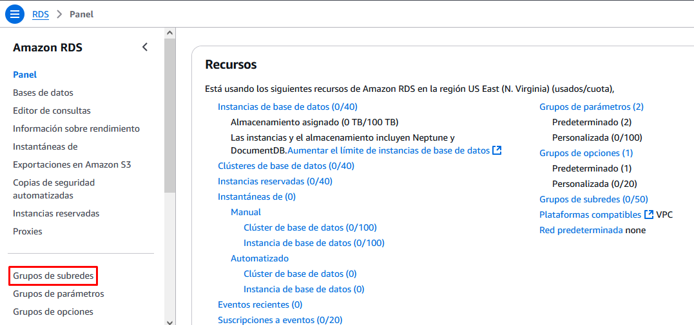

# Bases de Datos Gestionadas (sin acceso público)

## Objetivo del Proyecto

En esta práctica vamos a crear una base de datos RDS similar a la anterior, pero la vamos a ubicar en una subred privada de manera que no sea accesible desde Internet.

En una subred pública de la VPC crearemos una máquina virtual accesible desde Internet y que sí que podrá acceder a la base de datos. Este sería un modelo típico en el que tenemos un servidor (por ejemplo un servidor web) accesible desde Internet que ataca a una base de datos no accesible desde el exterior, aumentando así la seguridad de nuestros datos necesarios para la aplicación web.


## Esquema en AWS


## Práctica a Realizar
1.-	Eliminamos la *VPC predeterminada* y nos aseguramos que no hay ningún recurso creado en anteriores prácticas (grupos de seguridad, NAT Gateway, instancias EC2, bases de datos, ...)

<br>
___

### Creación de la VPC y la máquina EC2

2.-	Creamos una nueva VPC con la siguientes características:

- El bloque de CIDR será 10.0.0.0/16
- Debe tener 2 AZs.
- 2 Subredes públicas (10.0.1.0/24 y 10.0.2.0/24) cada una en una AZ.
- 2 Subredes privadas (10.0.3.0/24 y 10.0.4.0/24) cada una en una AZ.
- No es necesario un *Gateway NAT* ni un *Gateway de S3*

!!! note "Nota"

    Aunque no usemos Multi-AZ, AWS requiere al menos dos subredes privadas en diferentes AZ para RDS. Esto mejora la flexibilidad y disponibilidad, aunque la configuración inicial sea simple.

<br>
___


3.-	Vamos a crear una instancia EC2 en la primera subred pública:

- La imagen será la AMI de Ubuntu.
- El tamaño será suficiente con un tipo de instancia *t2.micro*.
- El par de claves utilizaremos el del laboratorio (*vockey*).
- La ubicamos en la primera subred pública (*subnet-public1*).
- Le asignamos una IP Pública para poder conectarnos desde Internet.
- Nos aseguramos que se crea una regla de firewall para permitir las conexiones por el puerto SSH (22).
- Para hacer que durante el primer lanzamiento de la instrancia se instale el cliente de MySQL ponemos las siguientes líneas en el apartado de **Datos de usuario**:
```bash
#!/bin/bash
apt update
apt install -y  mysql-client-core-8.0
```

<br>
___


4.-	Una vez creada la instancia EC2 comprobamos su IP pública y nos conectamos por ssh desde nuestra máquina local para comprobar que todo funciona.

<br>
___

### Creación de la Base de Datos

El primer requisito para crear una base de datos RDS es definir un **grupo de subredes de bases de datos** en nuestra VPC. 

!!! info
    Un grupo de subredes de bases de datos es una colección de subredes dentro de una VPC que RDS utiliza para desplegar instancias de bases de datos. Permite especificar en qué subredes y zonas de disponibilidad se pueden alojar las bases de datos. Es necesario que al menos contenga 2 AZ, por eso la necesidad de crear nuestra VPC con al menos 2 zonas de disponibilidad, aunque solamente utilicemos una.

5.-	Accedemos a la consola de RDS y creamos **grupo de subredes** con las 2 subredes privadas:

- Seleccionamos las 2 zonas de disponibilidad de nuestra VPC (en principio serán *us-east-1a* y *us-east-1b*).
- Seleccionamos las 2 subredes privadas (*subnet-private1* y *subnet-private2*), puesto que deseamos crear nuestra base de datos dentro de una de las subredes privadas.




<br>
___


6.-	Ahora sí creamos una Base de Datos RDS:

- Seleccionamos el método de *creación estándar*.
- Como motor de base de datos elegimos **MySQL**.
- La plantilla sobre la que se va a basar será la *Capa gratuita* (las demás no son aptas para el laboratorio).
- Ponemos un nombre de servidor que debe ser único en nuestra cuenta de AWS.
- Asignamos nombre de usuario administrador y su contraseña.
- Dejamos las opciones por defecto del tamaño de la instancia y el almacenamiento.
- En el apartado **Conectividad**:
    - Indicamos que vamos a conectar nuestra base de datos a una instancia EC2 y la seleccionamos en el desplegable.
    - En el *Grupo de subredes* elegimos la existente que hemos creado en el punto anterior.
    - NO permitimos el *Acceso Público* a nuestra BBDD. 
    - Elegimos como *grupo de seguridad*, el existente por defecto. Nos informa que además se creará un nuevo grupo de seguridad para conectar la instancia EC2 con la RDS.
- Los demás campos los dejamos por defecto.

<br>
___


7.-	Iniciamos sesión desde la máquina ubuntu y comprobamos que podemos conectarnos a la instancia MySQL, indicando la cadena de conexión y el usuario que hemos definido como administrador. En el parámetro host `-h` ponemos el nombre del servidor y en el parámetro de usuario `-u` el nombre del usuario. Para que nos solicite el password indicamos el parámetro `-p`.

`mysql -h database-jrpm.cruqs8qiedha.us-east-1.rds.amazonaws.com -u admin -p`

<br>
___

### Eliminación de los recursos creados

Una vez comprobada la conexión, para finalizar la práctica eliminamos los recursos creados.

8.- Desde la consola de AWS, **elimina el servidor de BBDD creado para asegurarnos que no dejamos ningún recurso consumiendo crédito**. No crees ninguna instantánea final ni conserves las copias de seguridad.

!!! warning "Atención"
    Si detenemos un servidor de BBDD (sin eliminarlo), AWS lo iniciará automáticamente a los 7 días (si no lo hemos levantado nosotros de manera manual antes). Esto es peligroso, pues si olvidamos eliminar un recurso de BBDD que no utilizamos, se pondrá en marcha automáticamente a los 7 días de haberlo detenido, con el consiguiente consumo de crédito.


<br>
___

9.- Desde la consola de AWS, **elimina la instancia EC2**. 

<br>
___

10.- Desde la consola de AWS, **elimina la VPC**. 

<br>
___