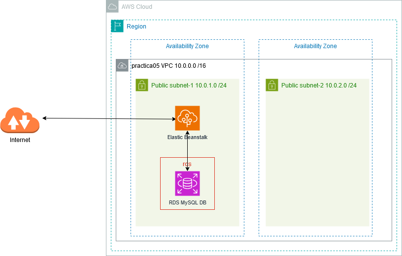
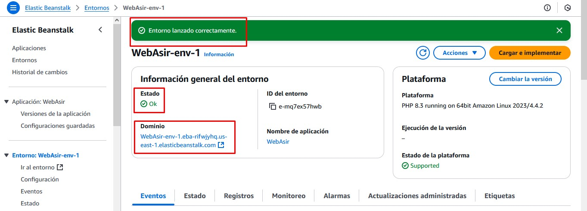
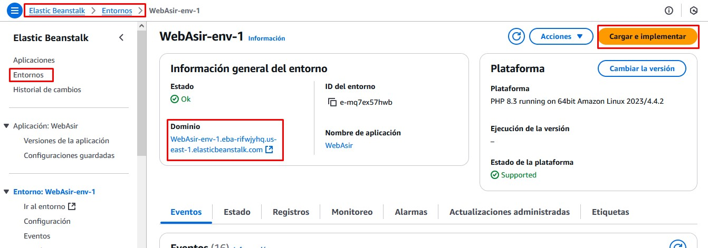
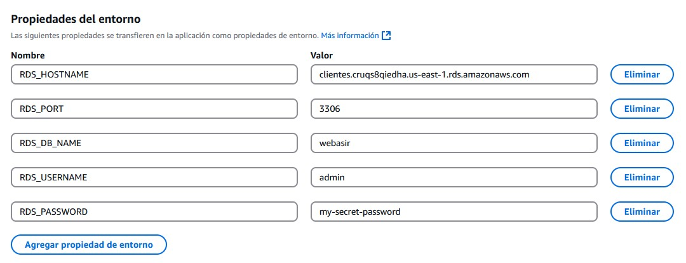
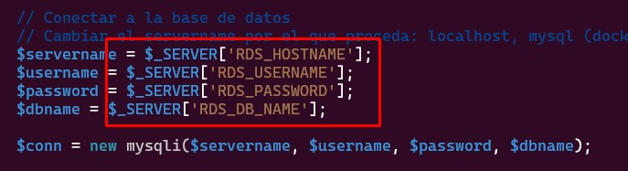

# Aplicaciones web con Elastic Beanstalk

## Objetivo del Proyecto

En esta práctica vamos a desplegar una aplicación web de manera totalmente gestionada mediante Elastic Beanstalk, un servicio PaaS que nos ofrece AWS para para implementar y escalar aplicaciones y servicios web. Únicamente hemos de encargarnos de subir el código y Elastic Beanstalk administrará de manera automática la implementación, desde el aprovisionamiento de la capacidad, el equilibrio de carga y el escalado automático hasta la supervisión del estado de la aplicación.

AWS Elastic Beanstalk admite aplicaciones web escritas en varios lenguajes y marcos populares. No necesita cambios de código, o muy pocos, para pasar de la máquina de desarrollo a la nube. Las opciones de desarrollo para implementar aplicaciones web son Java, .NET, Node.js, PHP, Ruby, Python, Go y Docker, entre otras.


## Esquema en AWS



## Práctica a Realizar
1.-	Eliminamos la *VPC predeterminada* y nos aseguramos que no hay ningún recurso creado en anteriores prácticas (grupos de seguridad, NAT Gateway, instancias EC2, bases de datos, ...)

<br>
___

### Creación de la VPC

2.-	Creamos una nueva VPC con la siguientes características:

- Debe tener 2 AZs.
- 2 Subredes públicas, cada una en una AZ.
- No es necesario un *Gateway NAT* ni un *Gateway de S3*

!!! note "Nota"

    Aunque no usemos Multi-AZ, vamos a crear 2 zonas de disponibilidad por si añadimos una base de datos RDS en nuestra aplicación. Como ya sabemos, AWS requiere al menos dos subredes privadas en diferentes AZ para RDS.

<br>
___

### Creación de la aplicación con Elastic Beanstalk

3.-	Accede al servicio **Elastic Beanstalk** y **Crea una aplicación**:

- El entorno será un servidor web.
- Le asignamos un nombre, por ejemplo *WebAsir*
- En el tipo de plataforma sobre la que va a correr nuestra aplicación seleccionamos **PHP**, puesto que será una aplicación web que correrá en ese entorno de programación.
- En el código de la aplicación dejamos de momento la *Aplicación de ejemplo*.
- Necesitamos especificar un Rol de acceso al servicio. Seleccionamos el existente del laboratorio *LabRole*.
- En el par de claves necesario para la máquina sobre la que correrá seleccionamos también el del laboratorio *vockey*.
- En el perfil de instancia de EC2, seleccionamos *LabInstanceProfile*.
- La VPC será la creada en el paso anterior.
- En el apartado subredes de instancia seleccionamos las 2 subredes creadas.
- Los demás campos los dejamos sin marcar (no creamos ninguna BBDD ni asignamos IP Pública)


!!! note "Nota"

    Podríamos haber creado aquí una Base de Datos que se conecte a la aplicación, pero no lo hacemos en este momento. Veremos cómo conectar más tarde una BBDD que ya esté creada.

<br>
___

### Comprobación del funcionamiento

4.-	Una vez lanzado el entorno correctamente y cuando su estado aparezca *Ok*, comprobamos su Dominio y lo abrimos en el navegador (simplemente haciendo click encima) para comprobar que todo funciona. Nos debe aparecer una web con el código de ejemplo en la que aparece *Congratulations!*



<br>
___

### Carga de nuestro código

Esel momento de cargar un código propio a nuestra aplicación de Beanstalk. Vamos a utilizar en esta práctica un código HTML + PHP que se encuentra en el repositorio [https://github.com/jrpellicer/asirweb](https://github.com/jrpellicer/asirweb)

5.-	Accedemos al repositorio de GitHub y en el botón de `Code` pulsamos sobre **Download ZIP**

!!! warning "Atención"

    Para subir la aplicación a Beanstalk necesitamos un fichero `.zip` (o un fichero `.tar.gz`) pero no nos vale el que acabamos de descargar. El descargado contiene una carpeta con los archivos de la página web en ella, pero Beanstalk necesita que los archivos estén en la raíz del fichero `.zip` (sin carpeta).

<br>
___

6.- Una vez descargado el código vamos a descomprimir el archivo para después volver a comprimirlo, pero sin incluir los archivos en ninguna carpeta comprimida.

=== "Windows"

    1. Extrae el ZIP en una carpeta.
    2. Selecciona los archivos dentro de la carpeta extraída.
    3. Haz clic derecho y elige "Enviar a > Carpeta comprimida".

=== "Linux"

    1. Sitúate en la carpeta donde se ha descargado el archivo.
    2. Descomprime el archivo: `unzip asirweb-main.zip`
    3. Sitúate en el directorio creado al descomprimir: `cd asirweb-main`
    4. Vuelve a comprimir seleccionando todos los ficheros: `zip -r ../codigo.zip *`
    5. Nos ha dejado en el directorio padre un fichero llamado *codigo.zip* listo para ser subido.

<br>
___

7.- Volvemos a la consola de AWS y en la pantalla de nuestro Entorno de la aplicación de Beanstalk pulsamos sobre el botón **Cargar e implementar**.



<br>
___

8.- Subimos el archivo `.zip` con nuestro código generado en el paso anterior e implementamos.

Esperamos a que se actualice el entorno y accedemos al dominio web para comprobar los cambios.

<br>
___

### Conexión a una BBDD

Es bastante probable que en nuestros proyectos web deseemos conectar una base de datos para interactuar con ella. Si accedemos a nuestra página web cargada, veremos que hay un botón que pone `Ver Listado` que da error al pulsarlo, pues ejecuta un código PHP que se conecta a una base de datos que no existe.

El primer paso será crear una BBDD RDS.

6.-	Accedemos a la consola de RDS y creamos una Base de Datos:

- Seleccionamos el método de *creación estándar*.
- Como motor de base de datos elegimos **MySQL**.
- La plantilla sobre la que se va a basar será la *Capa gratuita* (las demás no son aptas para el laboratorio).
- Ponemos un nombre de servidor que debe ser único en nuestra cuenta de AWS.
- Asignamos nombre de usuario administrador y su contraseña.
- Dejamos las opciones por defecto del tamaño de la instancia y el almacenamiento.
- En el apartado **Conectividad**:
    - Seleccionamos la VPC en la que está ubicado nuestro proyecto de Beanstalk.
    - Permitimos el *Acceso Público* a nuestra BBDD (para poder conectarnos desde nuestra máquina local y cargar datos).
    - Elegimos como *grupo de seguridad*, el existente por defecto. 
- Los demás campos los dejamos por defecto.

<br>
___


7.- Accedemos al *Grupo de seguridad* asociado a la base de datos y editamos las reglas de entrada para permitir el acceso al puerto MYSQL/Aurora (3306) desde todas las direcciones (0.0.0.0/0)

<br>
___


8.- En nuestra máquina local nos conectamos a la base de datos mediante el comando `mysql` y comprobamos la conexión.

<br>
___


9.- Vamos a crear una base de datos con una tabla. Lo vamos a hacer mediante un script de sentencias sql. Para ello comenzamos con la descarga del fichero de creación de la base de datos.

=== "Linux"

    ```
    wget https://github.com/jrpellicer/awsasir/blob/6412296fcf8fc21b6a794e48c692dd0f36883bcd/docs/asir.sql
    ```

=== "Windows"

    [Descarga fichero sql](./asir.sql)

<br>
___

8.- Ejecutamos las instrucciones SQL que hay en el contenido del fichero descargado. Basta con redireccionar la entrada del comando `mysql` con el fichero descargado de nombre `asir.sql`.

```
mysql -h database-jrpm.cruqs8qiedha.us-east-1.rds.amazonaws.com -u admin -p < asir.sql
```

!!! warning "Atención"

    Una vez creadas las tablas y los datos de la base de datos, podríamos modificar las reglas de entrada del grupo de seguridad para eliminar el acceso desde Internet al puerto 3306.

<br>
___


Una vez creada la base de datos, vamos a enlazarla con la aplicación de Beanstalk mediante el paso de variables de entorno con los datos de la base de datos que acabamos de crear (Host, Puerto, Usuario, Contraseña y Nombre de la BD).

9.- Accedemos a la consola de Beanstalk y seleccionamos nuestro entorno.

<br>
___


10.- En el panel de navegación seleccionamos *Configuración*:

- En la categoría de configuración *Actualizaciones, monitoreo y registro*, seleccionamos *Editar*.
- En la sección *Propiedades del entorno* (la última) definimos las variables (*propiedades*) que leerá la aplicación para crear la cadena de conexión. Hay que mantener los nombres y poner su correspondiente valor:
    - RDS_HOSTNAME
    - RDS_PORT
    - RDS_DB_NAME
    - RDS_USERNAME
    - RDS_PASSWORD

!!! note "Nota"

    El valor de cada variable será el definido en la base de datos RDS que hemos creado. *RDS_HOSTNAME* será la cadena de conexión. *RDS_PORT* será el 3306, *RDS_DB_NAME* será *webasir* (se ha creado en el script) y los demás datos serán los que hayamos definido en el momento de la creación.



<br>
___

### Modificación del código

Una vez definidas las variables de entorno con sus valores es momento de utilizarlas en la página *listado.php*.

11.- En la máquina local nos situamos en el directorio donde habíamos descomprimido el código fuente de nuestra aplicación y con un editor accedemos al fichero `listado.php`.

<br>
___

12.- Modificamos las líneas del código de las variables de conexión para que utilicen las variables de entorno creadas:



<br>
___

13.- Volvemos a crear el archivo zip y lo subimos al entorno.

<br>
___

14.- Comprobamos que la aplicación accede a la base de datos y ya funciona el listado.


### Eliminación de los recursos creados

Una vez comprobada la conexión, para finalizar la práctica eliminamos los recursos creados.

8.- Desde la consola de AWS, **elimina el servidor de BBDD creado para asegurarnos que no dejamos ningún recurso consumiendo crédito**. No crees ninguna instantánea final ni conserves las copias de seguridad.

!!! warning "Atención"
    Si detenemos un servidor de BBDD (sin eliminarlo), AWS lo iniciará automáticamente a los 7 días (si no lo hemos levantado nosotros de manera manual antes). Esto es peligroso, pues si olvidamos eliminar un recurso de BBDD que no utilizamos, se pondrá en marcha automáticamente a los 7 días de haberlo detenido, con el consiguiente consumo de crédito.


<br>
___

9.- Desde la consola de AWS, **elimina la aplicación de Elastic Beanstalk**. 

Al eliminar la aplicación se terminará el entorno sobre el que corre.

<br>
___

10.- Desde la consola de AWS, **elimina la VPC**. 

<br>
___
